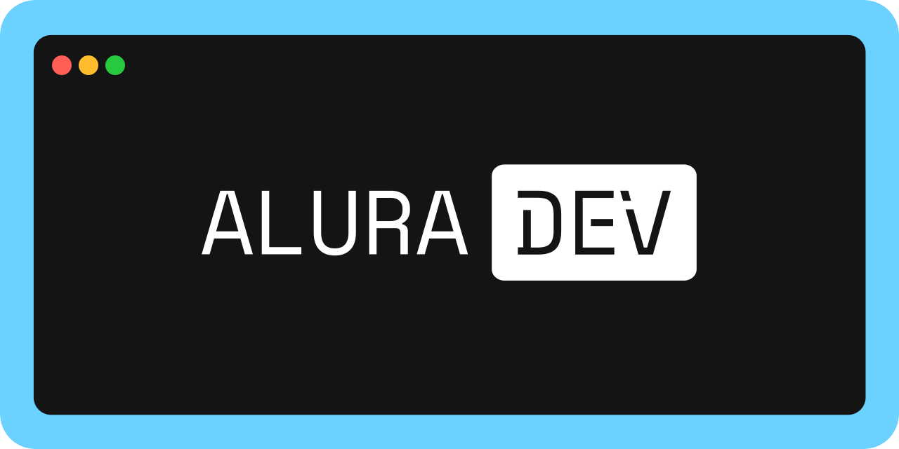
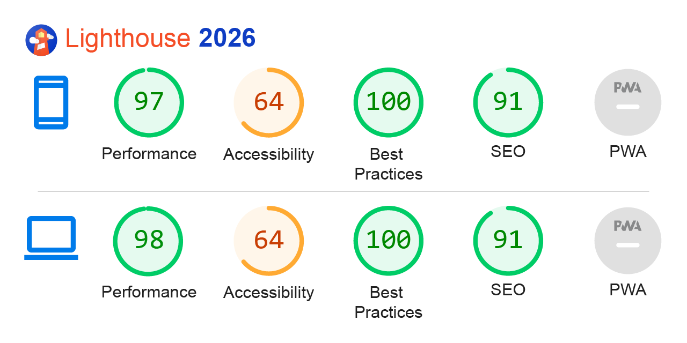

<h1 align="center"> 👨‍💻 Semana Dev Alura 👩‍💻 </h1>


## 📑 Table of Contents

- [📑 Table of Contents](#-table-of-contents)
- [📖 Overview](#-overview)
- [🛠️ Technologies](#-technologies)
- [⚡ Performance & PWA](#-performance--pwa)
- [🚀 Demo](#-demo)
- [📦 Install and Use](#-install-and-use)
- [📂 File Structure](#-file-structure)
- [🎨 Reference & Inspiration](#-reference--inspiration)
- [👨‍💻 Author and Contact](#%E2%80%8D-author-and-contact)

## 📖 Overview

This repository serves as a curated collection of bite-sized code snippets and simple web demonstrations. It is designed to provide quick, practical examples of web development concepts, UI components, and layout structures. Whether used for testing isolated features or as a quick technical reference, the codebase is kept minimal, modular, and easy to understand.

## 🛠 Technologies

The following technologies were used to build this project:

- [HTML5](https://developer.mozilla.org/en-US/docs/Web/HTML)
- [CSS3](https://developer.mozilla.org/en-US/docs/Web/CSS)
- [Javascript](https://developer.mozilla.org/en-US/docs/Web/JavaScript)

## ⚡ Performance & PWA



## 🚀 Demo

Access the live application below to interact with the interface and run your own performance tests.

Semana Dev Alura: 

### Desktop

Coming Soon!

### Mobile

Coming Soon!

## 📦 Install and Use

**Prerequisites:** Node.js (v22.x) or higher installed.

1. Clone the repository:
```bash
git clone https://github.com/Epiled/semana-dev-alura.git
cd semana-dev-alura
```

2. Install the dependencies:
```bash
npm install
```

3. Run the development environment (Build + Watch + Server):
```bash
npm run dev
```

## 📂 File Structure

Below is the project architecture. All development should be done inside the src/ folder.

```text
semana-dev-alura/
├── design/                  # Wireframes, videos and assets for documentation
├── src/                     # Main source code (Development)
│   ├── assets/              # Original images and icons
│   ├── css/                 # Styles following architecture BEM and Atomic Design principles
│   └──js/                   # UI logic and PWA registration
└── index.html               # Base semantic structure and main markup
```

## 🎨 Reference & Inspiration

The project's design and wireframes are available for viewing on Figma. Below is a list of the real-world examples that inspired the UI/UX design.

Figma / Wireframe: [Semana Dev Alura](https://www.figma.com/design/JYoadEDIGZwpBCkEFTGlEm/Alura-Challenge---Edi%C3%A7%C3%A3o-Front-end--Copy-?node-id=207-729&t=P2TezNrKR9C9X48j-1)

## 👨‍💻 Author and Contact

<a href="https://github.com/Epiled">
  
  <br />
  <sub><b>Felipe De Andrade</b></sub>
</a>

Made with ❤️ by Felipe De Andrade 👋🏽 Get in touch!

[](https://www.linkedin.com/in/fademendonca/)
[](https://codepen.io/epiled)
[](mailto:felipe.deam98@gmail.com)
